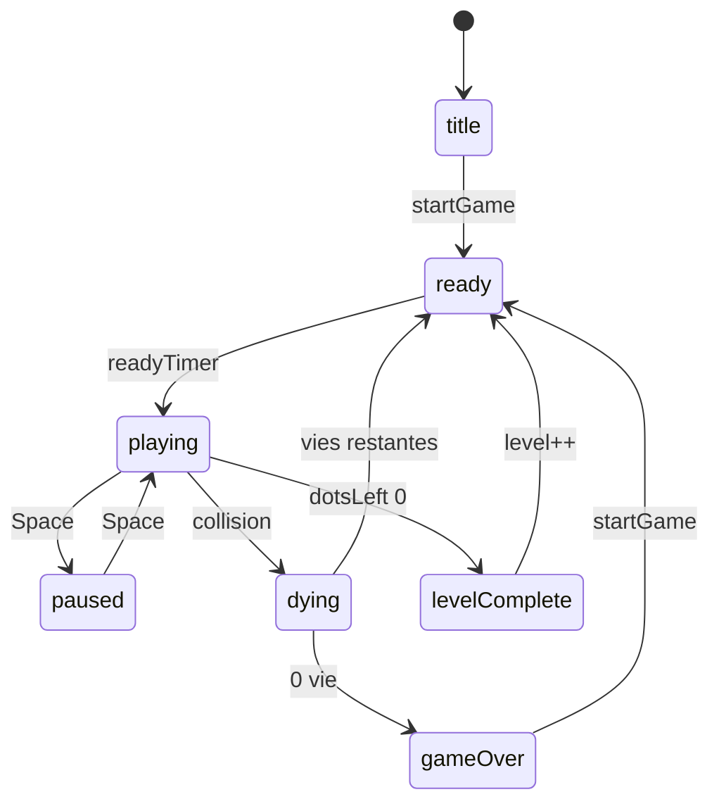

# Architecture — Pocman

## Fichiers

| Fichier | Role |
|---------|------|
| `index.html` | Structure DOM, HUD, canvas |
| `styles.css` | Presentation |
| `js/core.mjs` | Labyrinthe, constantes, logique pure (testable) |
| `js/entities.mjs` | Pac-Man, fantomes, classe Entity |
| `js/render.mjs` | Canvas, murs, overlays, popups |
| `js/game.mjs` | Etat, collisions, niveaux, score |
| `js/input.mjs` | Clavier, D-pad, swipe |
| `js/audio.mjs` | Sons synthetiques Web Audio |
| `js/main.mjs` | Orchestration, boucle rAF, SW |
| `sw.js` | Cache offline PWA |

## Machine a etats (`game.state`)

## Fantomes (`Ghost.mode`)

- `HOUSE` : rebond puis sortie via `updateHouse`
- `SCATTER` / `CHASE` : cycle temporel `game.modeCycle`
- `FRIGHTENED` : apres power pellet
- `EATEN` : retour maison puis `HOUSE` avec `exitTimer`

## Alignement grille

`isAlignedAt(x, y, speed)` utilise `speed - 0.5` pour eviter l oscillation pixel.

## Tests

`tests/core.test.mjs` couvre `js/core.mjs` (alignement, tunnel, porte, sortie maison, demi-tour).
