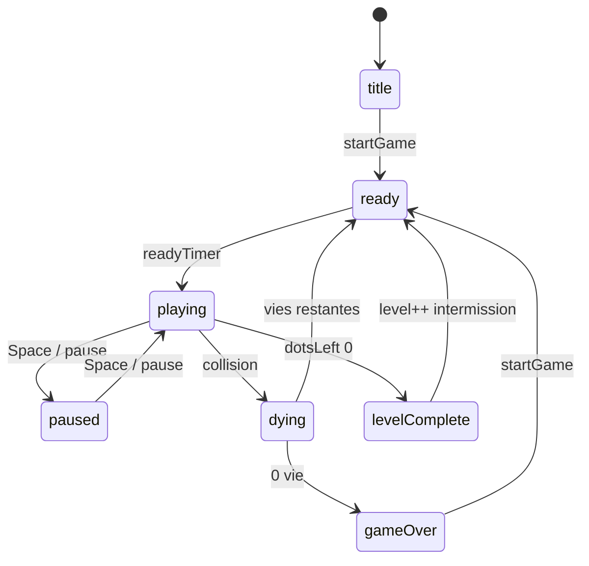

# Architecture — Pocman

## Fichiers

| Fichier | Role |
|---------|------|
| `index.html` | Structure DOM, HUD, canvas, D-pad |
| `styles.css` | Presentation responsive |
| `js/core.mjs` | Labyrinthe, constantes, logique pure (testable) |
| `js/entities.mjs` | Pac-Man, fantomes |
| `js/game.mjs` | Etat, collisions, fruits, Elroy |
| `js/render.mjs` | Canvas HiDPI, cache pastilles, overlays |
| `js/input.mjs` | Clavier, D-pad, swipe, pause |
| `js/hud.mjs` | Mise a jour DOM (score, record, annonces) |
| `js/audio.mjs` | Sons Web Audio + mute |
| `js/main.mjs` | Orchestration, boucle rAF, SW |
| `sw.js` | Cache offline PWA |
| `e2e/` | Tests Playwright |
| `tests/` | Tests Vitest unitaires |

## Machine a etats (`game.state`)



## Fantomes (`Ghost.mode`)

- `HOUSE` : rebond puis sortie via `getHouseExitAction`
- `SCATTER` / `CHASE` : cycle `game.modeCycle`
- `FRIGHTENED` : power pellet, restaure `modeBeforeFright`
- `EATEN` : retour maison puis `HOUSE`
- **Elroy** : Blinky accelere si `dotsLeft <= 20`

## Gameplay v1.5

- Mouvement : `movePixels(speed, dt)` (60 FPS reference)
- Fruit : spawn apres 70 pastilles, case (13, 17), 9 s
- Vie bonus : 10 000 points (une fois)
- Vitesses : `speedMultiplierForLevel(level)`

## Rendu

- `devicePixelRatio` (max 2) sur le canvas principal
- Cache offscreen : murs + pastilles statiques
- `prefers-reduced-motion` : animations reduites

## Tests

| Suite | Cible |
|-------|--------|
| `tests/core.test.mjs` | `core.mjs` |
| `tests/game-logic.test.mjs` | fonctions pures score/fruit/elroy |
| `tests/entities.test.mjs` | IA fantomes |
| `tests/game.test.mjs` | `createGame` (mocks) |
| `e2e/game.spec.js` | chargement page, Space |

```bash
npm test
npm run test:coverage
npm run test:e2e
```

## PWA

- SW version alignee manifest (`pacman-1.5.0`)
- Banniere `#sw-update` + `SKIP_WAITING`
- Screenshots manifest (icon-512)
